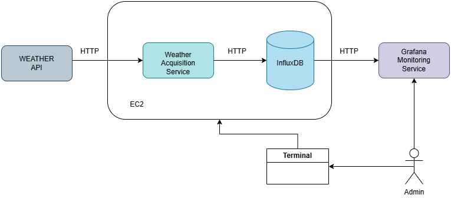
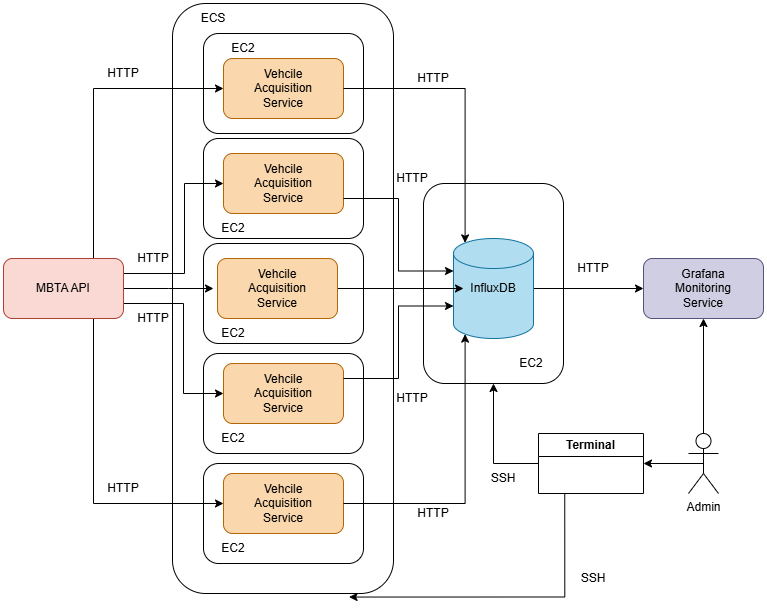

##### Copyright 2024 Maria-Teona Olteanu

# IoT Project: Delay in Public Transport Networks

## Introduction

We implemented a prototype for a real-time sensing and data visualization platform and analyzed the data to explore the relationship between weather and congestion (delays) in the Boston public transport network.

## Sensing Setup

### Groundwork (API Analysis)

The code used to understand the APIs can be found in folder **/analysis**.

We collected data from two different sources: 
- weather data from [WeatherAPI.com API](https://www.weatherapi.com/)
- vehicle data from [MBTA API](https://www.mbta.com/developers/v3-api)

#### Weather Request and Response
##### Real-Time Weather Data Request
```http
GET https://api.weatherapi.com/v1/current.json?key=<api_key>&q=<city>
```
##### Partial Response from Weather API
```json
{
  "location": {
    ...
  },
  "current": {
    "last_updated": "2024-12-13 09:30",
    "temp_c": -1.7,
    "humidity": 46,
    "precip_mm": 0.0,
    "wind_kph": 12.6,
    ...
  }
}
```

#### MBTA Requests and Responses
##### Real-Time Vehicle Data Request
```http
GET https://api-v3.mbta.com/vehicles/<id>
```

##### Partial Response from Vehicle API
```json
{
  "attributes": {
    "current_status": "STOPPED_AT",
    "latitude": 42.36563677,
    "longitude": -71.18501876,
    ...
  },
  "relationships": {
    "trip": {
      "data": {
        "id": "71",
        "type": "trip"
      }
    },
    "stop": {
      "data": {
        "id": "8178",
        "type": "stop"
      }
    }
    ...
  },
  ...
}
```

#####  Real-Time Scheduled and Predicted Time of Arrival Requests
```http
GET https://api-v3.mbta.com/schedules?filter[trip]=<trip>&filter[stop]=<stop>
```
```http
GET https://api-v3.mbta.com/predictions?filter[trip]=<trip>&filter[stop]=<stop>
```

##### Partial Response from Schedules or Predictions API
```json
{
  "attributes": {
    "arrival_time": "2024-12-11T18:06:05-05:00",
    ...
  }
}
```

### General Logic

We implemented 2 services that query their associated API, process the response and send it to the InfluxDB database for storage. Each service polls the endpoints: the weather API is called every hour and vehicle data is collected at 2-minutes intervals. For vehicle data collection, we launch 5 separate services to simulate edge devices connected to one central server.    

##### Containerization & Service Dockerfile:
- base image: _python:3.8-slim_
- installs the pip package
- installs the needed dependencies (requests, schedule, pytz, influxdb)

#### Local Deployement
Logic for the acquisition services and local deployment can be found in **/local** directory.

For local development we used the influxdb:1.8 docker image for the InfluxDB database and docker compose to streamline deployment.

#### AWS Deployement
Logic for the acquisition services and AWS deployment can be found in **/aws** directory.

For cloud development, we created two seperate EC2 instances where we installed and configured InfluxDB databases for weather and vehicle data.

The weather data collection service is launched on the same EC2 instance as the weatehr database.

##### Weather Data Collection Logic
 

The vehicle acquisiton services are launched using AWS ECS commands (scripts are available in the **/ecs-mbta**). To ensure redployement in case of failure we used ECS services for deployment. The launch process is:
1. create task definition 
2. create service 
3. run task on service

Each service runs on its own EC2 instance. To connect the services to the database we use security rules.

##### Vehicle Data Collection Logic


## Data Visualization
Folder **/graphics** contains the configurations for the dashboards created in Grafana.

## Data Analysis
Folder **/data** contains processed data, correlation analysis and scripts used to export and handle raw data from the dabases:
- **/scripts**: bash scripts to pull data from InfluxDB cloud instances 
- **/vehicle-exports**: exported vehicle data  
- **/vehicle-exports**: exported weather data

For the analysis we created the correlation matrices and weather data distribution (**corr.ipynb**). The generated results are available in **/img**.

